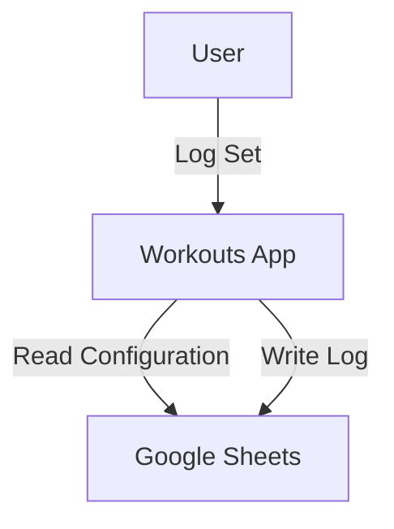

# MVP Design

This document outlines the Minimum Viable Product (MVP) for the Workouts application.

## Goals
1.  **Frictionless Logging**: Quick entry of sets, reps, and weight during a workout.
2.  **Privacy-First Customization**: User defines exercises and programs in their own Google Sheet.
3.  **Cloud Storage**: Use Google Sheets as the backend database.

## Architecture

## User Stories

### Authentication
-   **US-001**: As a user, I want to sign in with my Google account so that the app can access my Sheets.
-   **US-002**: As a user, I want to grant permission to read/write specific spreadsheets so that I retain control over my data.

### Configuration (The "Config" Sheet)
-   **US-003**: As a user, I want to define my list of exercises in a spreadsheet so that I can add custom movements without app updates.
-   **US-004**: As a user, I want to define "Tags" (e.g., Push, Pull, Legs) for exercises so that I can filter them easily.

### Logging
-   **US-005**: As a user, I want to start a new workout session so that I can track my training for the day.
-   **US-006**: As a user, I want to select an exercise from my configured list.
-   **US-007**: As a user, I want to log a set (Weight, Reps, RPE) with a single tap.
-   **US-008**: As a user, I want a rest timer to start automatically after logging a set.

### History & Progress
-   **US-009**: As a user, I want to see my history for a specific exercise while logging so that I know what weight to use.
-   **US-010**: As a user, I want to visualize my estimated 1RM progress over time.

## Data Schema (Google Sheets)

The backend will be a single Google Spreadsheet with multiple tabs.

### Tab 1: `Events` (Source of Truth)
Append-only log of all actions.

| Column | Type | Description |
| :--- | :--- | :--- |
| `EventID` | UUID | Unique ID |
| `Timestamp` | ISO8601 | When it happened |
| `ActionType` | String | `workout/start`, `set/log`, `exercise/create` |
| `Payload` | JSON | Full details |

### Tab 2: `Config` (User Editable)
User-managed configuration.

| Exercise Name | Muscle Group | Movement Pattern | Default RPE |
| :--- | :--- | :--- | :--- |
| Squat | Legs | Squat | 8 |
| Bench Press | Chest | Push | 9 |

## UI Mockups (Descriptions)

### Dashboard
*   **Aesthetic**: Dark mode, "Data-First". High contrast numbers, neon accents (cyan/lime).
*   **Layout**:
    *   **Top**: "Start Workout" button (Prominent).
    *   **Middle**: "Weekly Consistency" heatmap (Green squares for active days).
    *   **Bottom**: "Quick Stats" - Total Volume this week, distinct exercises.

### Workout Logger
*   **Focus**: Efficiency. Large touch targets.
*   **Header**: Session Timer and Current Exercise Name.
*   **List**: Previous sets for the current session.
*   **Input**: Row of inputs for `Weight (kg)`, `Reps`, `RPE`.
*   **Actions**: Large "Log Set" button. "Next Exercise" button.

### Analytics
*   **Chart**: Line graph of Estimated 1RM for selected exercise.
*   **Data**: Clean, glowing line chart against dark background.
