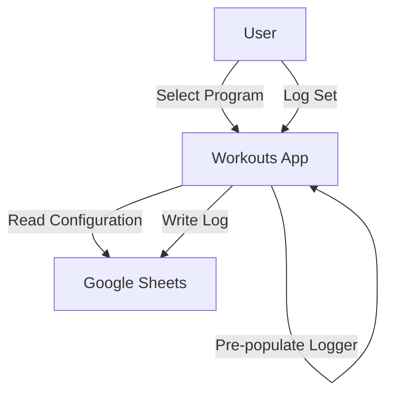

# MVP Design

This document outlines the Minimum Viable Product (MVP) for the Workouts application.

## Goals
1.  **Frictionless Logging**: Quick entry of sets, reps, and weight during a workout.
2.  **Privacy-First Customization**: User defines exercises and programs in their own Google Sheet.
3.  **Structured Training**: Users follow defined programs to ensure progressive overload.
4.  **Cloud Storage**: Use Google Sheets as the backend database.

## Architecture

## User Stories

### Authentication
-   **US-001**: As a user, I want to sign in with my Google account so that the app can access my Sheets.
-   **US-002**: As a user, I want to grant permission to read/write specific spreadsheets so that I retain control over my data.

### Configuration (The "Config" Sheet)
-   **US-003**: As a user, I want to define my list of exercises in a spreadsheet so that I can add custom movements without app updates.
-   **US-004**: As a user, I want to define "Tags" (e.g., Push, Pull, Legs) for exercises so that I can filter them easily.
-   **US-005**: As a user, I want to define "Programs" (e.g., PPL, Starting Strength) and "Days" (e.g., Pull Day) in a spreadsheet so I can structure my training.
-   **US-006**: As a user, I want to list the exercises for each Program Day in a specific order.

### Workout Selection (Pre-Logging)
-   **US-007**: As a user, I want to select a "Program" and "Day" from my configured list before I start logging.
-   **US-008**: As a user, I want to see the list of exercises for the selected day pre-populated in the logger.
-   **US-009**: As a user, I want to be able to add ad-hoc exercises to the session even if I selected a program.

### Logging
-   **US-010**: As a user, I want to log a set (Weight, Reps, RPE) with a single tap.
-   **US-011**: As a user, I want a rest timer to start automatically after logging a set.
-   **US-012**: As a user, I want to see my history for the current exercise while logging so that I know what weight to use.

### History & Progress
-   **US-013**: As a user, I want to visualize my estimated 1RM progress over time.

## Data Schema (Google Sheets)

The backend will use **two separate Google Spreadsheets** to clearly distinguish between user-editable configuration and internal data.

### Spreadsheet 1: `InternalEventLog` (Do Not Edit)
This sheet acts as the database's write-ahead log. It is strictly append-only.

| Column | Type | Description |
| :--- | :--- | :--- |
| `EventID` | UUID | Unique ID |
| `Timestamp` | ISO8601 | Server-side timestamp |
| `ActionType` | String | `workout/start`, `set/log`, `exercise/create` |
| `Payload` | JSON | Full details of the event |

### Spreadsheet 2: `Exercise Catalog` (User Editable)
This sheet is designed for the user to view and manage their available exercises, settings, and programs.

#### Tab 1: `Exercise Catalog`
Defines the available movements.

| Exercise Name | Muscle Group | Default RPE | Tags |
| :--- | :--- | :--- | :--- |
| Squat | Legs | 8 | Core, Powerlifting |
| Bench Press | Chest | 9 | Core, Powerlifting |
| ... | ... | ... | ... |

*(See `CONFIG_SHEET_DESIGN.md` for full details)*

#### Tab 2: `Programs` (New)
Defines the routines.

| Program Name | Day Name | Exercise Name | Order |
| :--- | :--- | :--- | :--- |
| PPL | Push | Bench Press | 1 |
| PPL | Push | Pec Fly | 2 |
| PPL | Pull | Deadlift | 1 |
| PPL | Pull | Pull Up | 2 |

## UI Mockups

### Program Selection (New Step)
*   **Goal**: Context setting before the workout.
*   **Aesthetic**: Large cards or a list for "Today's Plan".
*   **Action**: User selects "PPL - Push A".
*   **Result**: Navigates to Logger with Bench Press and Pec Fly pre-loaded.

### Dashboard
*   **Aesthetic**: Dark mode, "Data-First". High contrast, neon accents (cyan/lime).
*   **Top**: "Start Workout" button -> Leads to **Program Selection**.
*   **Key Metrics**: Row of sparkline cards for "Core Exercises" (e.g., Squat, Bench, Deadlift) showing current estimated 1RM.
*   **Bottom**: "See Full Analytics" button to drill down into detailed stats.

### Workout Logger
*   **Focus**: Efficiency. Large touch targets.
*   **Header**: Session Timer and Current Exercise Name.
*   **List**: Pre-populated list of exercises based on the selected program.
*   **Interaction**: User Taps an exercise to expand it and log sets.
*   **Input**: Row of inputs for `Weight (kg)`, `Reps`, `RPE`, with a checkbox to mark as done.
*   **Actions**: "Finish Workout" button.

### Analytics
*   **Chart**: Line graph of Estimated 1RM for selected exercise.
*   **Data**: Clean, glowing line chart against dark background.
