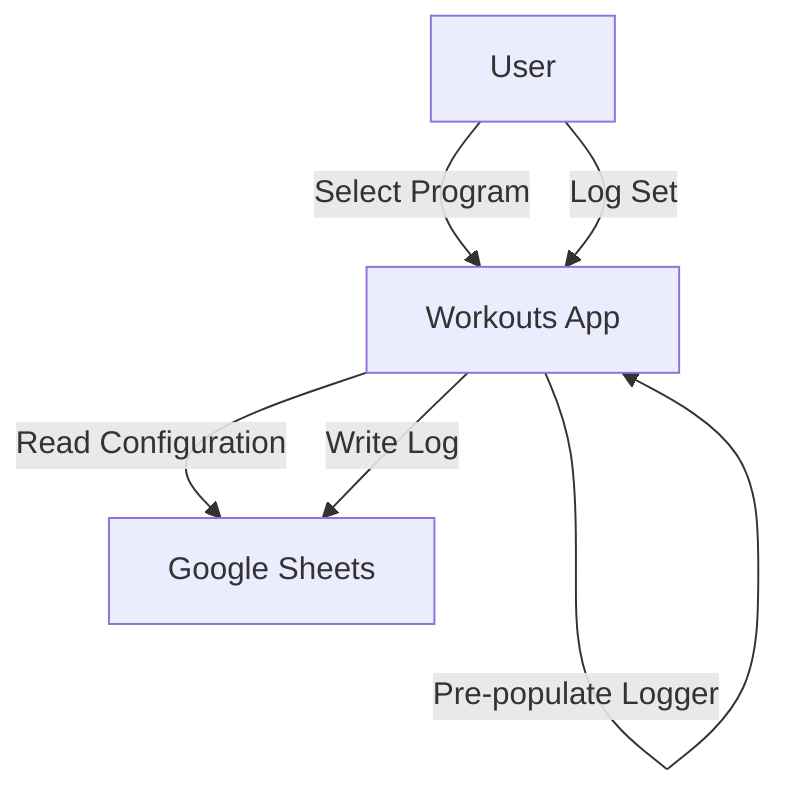
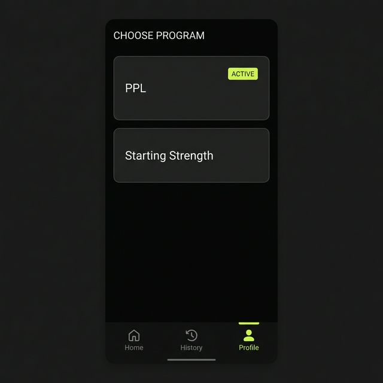
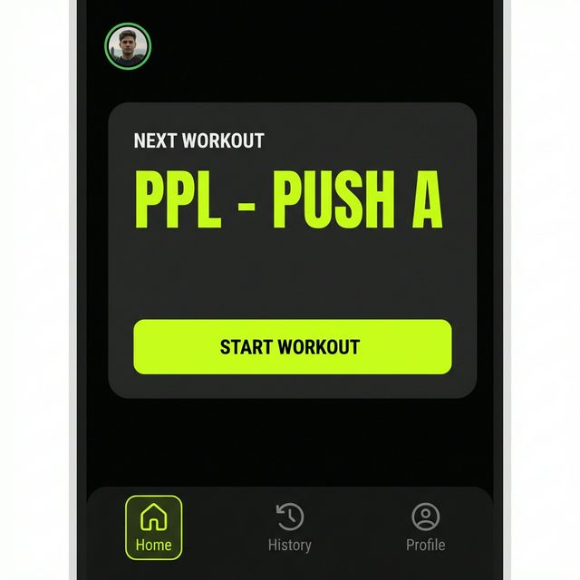
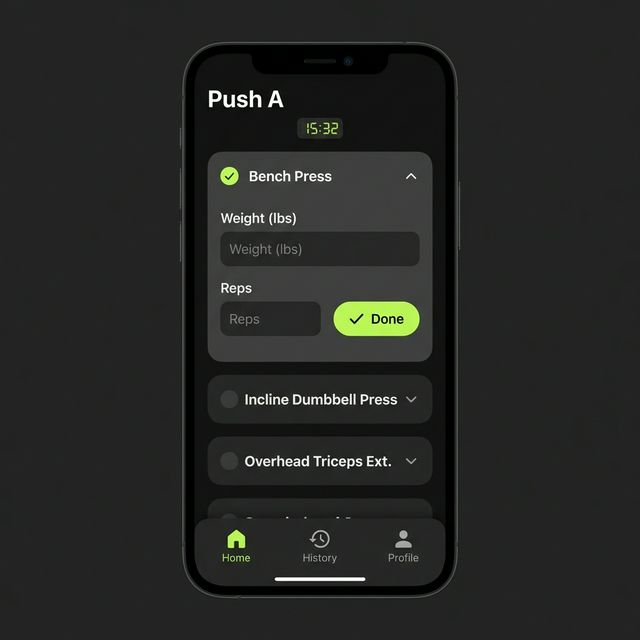

# MVP Design

This document outlines the Minimum Viable Product (MVP) for the Workouts application.

## Goals
1.  **Frictionless Logging**: Quick entry of sets, reps, and weight during a workout.
2.  **Privacy-First Customization**: User defines exercises and programs in their own Google Sheet.
3.  **Structured Training**: Users follow defined programs to ensure progressive overload.
4.  **Cloud Storage**: Use Google Sheets as the backend database.

## Architecture

## User Stories

### Authentication
-   **US-001**: As a user, I want to sign in with my Google account so that the app can access my Sheets.
-   **US-002**: As a user, I want to grant permission to read/write specific spreadsheets so that I retain control over my data.

### Configuration (The "Config" Sheet)
-   **US-003**: As a user, I want to define my list of exercises in a spreadsheet so that I can add custom movements without app updates.
-   **US-004**: As a user, I want to define "Tags" (e.g., Push, Pull, Legs) for exercises so that I can filter them easily.
-   **US-005**: As a user, I want to define "Programs" (e.g., PPL, Starting Strength) and "Days" (e.g., Pull Day) in a spreadsheet so I can structure my training.
-   **US-006**: As a user, I want to list the exercises for each Program Day in a specific order.

### Workout Selection (Pre-Logging)
-   **US-007**: As a user, I want to select a "Program" and "Day" from my configured list before I start logging.
-   **US-008**: As a user, I want the system to suggest the "Next Day" in my program automatically so I don't have to remember where I left off.
-   **US-009**: As a user, I want to manually override the suggested "Next Day" if I want to skip ahead or repeat a day.
-   **US-010**: As a user, I want to see the list of exercises for the selected day pre-populated in the logger.
-   **US-011**: As a user, I want to be able to add ad-hoc exercises to the session even if I selected a program.

### Logging
-   **US-012**: As a user, I want to log a set (Weight, Reps, RPE) with a single tap.
-   **US-013**: As a user, I want a rest timer to start automatically after logging a set.
-   **US-014**: As a user, I want to see my history for the current exercise while logging so that I know what weight to use.
-   **US-015**: As a user, I want to **substitute** a pre-populated exercise with a different one (e.g., if equipment is busy) so that my log remains accurate.
-   **US-016**: As a user, I want to **remove** an exercise from the current session if I decide to skip it.

### History & Progress
-   **US-017**: As a user, I want to visualize my estimated 1RM progress over time.

## Data Schema (Google Sheets)

The backend will use **two separate Google Spreadsheets** to clearly distinguish between user-editable configuration and internal data.

### Spreadsheet 1: `InternalEventLog` (Do Not Edit)
This sheet acts as the database's write-ahead log. It is strictly append-only.

| Column | Type | Description |
| :--- | :--- | :--- |
| `EventID` | UUID | Unique ID |
| `Timestamp` | ISO8601 | Server-side timestamp |
| `ActionType` | String | `workout/start`, `set/log`, `exercise/create` |
| `Payload` | JSON | Full details of the event |

### Spreadsheet 2: `Exercise Catalog` (User Editable)
This sheet is designed for the user to view and manage their available exercises.

| Exercise Name | Muscle Group | Default RPE | Tags |
| :--- | :--- | :--- | :--- |
| Squat | Legs | 8 | Core, Powerlifting |
| Bench Press | Chest | 9 | Core, Powerlifting |
| ... | ... | ... | ... |

*(See `CONFIG_SHEET_DESIGN.md` for full details)*

### Folder Structure (User Editable)
To manage Programs, the app uses a dedicated folder in Google Drive.
*   **Path**: `Workouts/Programs/`
*   **Content**: Individual Spreadsheets for each program (e.g., `PPL.xlsx`).

#### Program Spreadsheet Schema
Each program file defines a routine.
*   **Structure**: One **Sheet (Tab) per Week** of the program (e.g., `Week 1`, `Week 2`).
*   **Ordering**: Exercises are ordered by their row position.

| Day Name | Exercise Name | Load | Rep Range | RPE | Notes |
| :--- | :--- | :--- | :--- | :--- | :--- |
| Push | Bench Press | 70% | 5-8 | 8 | |
| Push | Pec Fly | | 10-12 | 9 | Drop set |
| Pull | Deadlift | 85% | 5 | | |

*   **Day Name**: Grouping key.
*   **Exercise Name**: Must match an entry in the `Exercise Catalog`.
*   **Load**: (Optional) Prescribed intensity as a **percentage of 1RM** (e.g., "70%").
*   **Rep Range**: (Optional) Target reps (e.g., "5", "8-12").
*   **RPE**: (Optional) Target intensity.

## UI Mockups

### Program Selection (Choose Program)
*   **Access**: Via "Profile" tab or "Change Program" link on Dashboard.
*   **Goal**: Switch active routine.
*   **Aesthetic**: Consistent with Dashboard. Vertical list of cards.
*   **Status**: Indicates "Active" program.

### Dashboard (Home)
*   **Goal**: Immediate access to the next session.
*   **Aesthetic**: Dark mode, "Data-First". High contrast, neon accents (cyan/lime).
*   **Primary Action**: Large "Next Workout" card showing current program and day (e.g., "PPL - Push A").
*   **Action Button**: "Start Workout" (Neon Lime, full width).
*   **Secondary**: Quick Stats (Sparklines) and Bottom Navigation [Home, History, Profile].

### Workout Logger
*   **Focus**: Efficiency. Large touch targets.
*   **Header**: Session Timer and Current Exercise Name.
*   **List**: Pre-populated list of exercises.
*   **Navigation**: Bottom Menu [Home, History, Profile] remains visible (or accessible).
*   **Interaction**: User Taps an exercise to expand it and log sets.
*   **Input**: Row of inputs for `Weight (kg)`, `Reps`, `RPE`, with a checkbox to mark as done.
*   **Actions**: "Finish Workout" button (bottom of list or top right).

### Analytics
*   **Chart**: Line graph of Estimated 1RM for selected exercise.
*   **Data**: Clean, glowing line chart against dark background.
