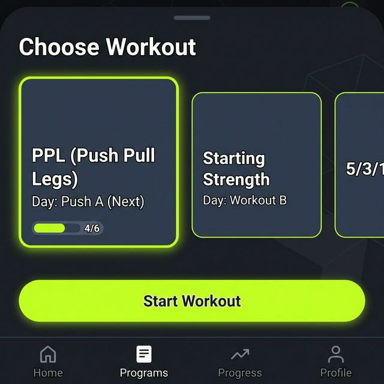

# UX Design: Programs

This document outlines the design and user experience for managing and selecting workout programs.

## Goals
1.  **Structure**: Allow users to define programs (e.g., PPL, Starting Strength) consisting of multiple days (e.g., Push A, Pull A).
2.  **Context**: Provide a "Pre-Workout" screen where users confirm their plan for the day.
3.  **Portability**: Programs should be easy to share and swap.

## Data Structure (Google Drive & Sheets)

To facilitate sharing and organization, programs are stored as individual Google Sheets within a dedicated folder.

*   **Root Folder**: `Workouts`
*   **Sub-Folder**: `Programs`
*   **Files**: One Spreadsheet per Program (e.g., `PPL.xlsx`, `Starting Strength.xlsx`).

### Program Sheet Schema

*   **Tabs**: Each **Week** of a program should be on its own Sheet (Tab) to allow for micro-cycles (e.g., volume ramp-up).
*   **Row Order**: The order of exercises is determined implicitly by their row number (top to bottom).

| Day Name | Exercise Name | Load | Rep Range | RPE | Notes |
| :--- | :--- | :--- | :--- | :--- | :--- |
| Push A | Bench Press | 70% | 5-8 | 8 | Heavy |
| Push A | Overhead Press | | 8-12 | 9 | |

*   **Day Name**: Grouping key for exercises.
*   **Exercise Name**: Must match an entry in the main `Exercise Catalog`.
*   **Load**: (Optional) Prescribed intensity as a percentage of 1RM (e.g., "70%", "85%").
*   **Rep Range**: (Optional) Prescribed reps (e.g., "5", "8-12").
*   **RPE**: (Optional) Target intensity (1-10) based on Rate of Perceived Exertion.
*   **Notes**: Optional form cues or instructions.

## UI Design

### 1. Program Selection (Choose Program)

This screen is accessed via the **Profile** tab or a "Change Program" link on the Dashboard. It is NOT the default landing screen.

*   **Header**: "Choose Program"
*   **List**: Vertical scrolling list of Program Cards.
*   **Card State**:
    *   **Active**: Highlighted (Neon Lime border/badge) indicating the current routine.
    *   **Inactive**: Standard appearance.
*   **Action**: Tapping a card sets it as "Active" and returns to Dashboard.

#### Mockups

**Option A (Original)**

**Option B (Unified)**

## Interaction Flow

1.  User enters **Profile** tab.
2.  User taps "Current Program: PPL".
3.  App shows **Choose Program** list.
4.  User selects "Starting Strength".
5.  App updates the "Active Program" pointer in `Config` sheet.
6.  User is returned to Dashboard, which now shows the next workout for "Starting Strength".

