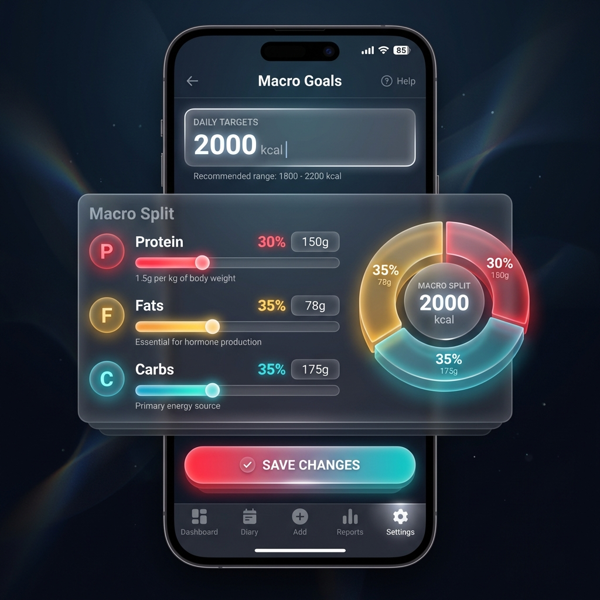

# Macro Settings Design

## Overview
This document outlines the design for allowing users to customize their daily calorie and macronutrient goals.

## UX Design
The settings screen will follow the "Immersive Utility" glassmorphism aesthetic.

### Visual Mockup


### Interaction Flow
1.  **Entry Point**: Navigation Bar -> Settings.
2.  **Input**:
    *   **Daily Calories**: Numeric input (e.g., 2000).
    *   **Macros**: Three sliders/inputs for Protein, Fat, Carbs.
        *   Primary input: Grams (for precision).
        *   Secondary display: Percentage/Ratio (the underlying source of truth).
        *   **Cascading Logic**: The user adjusts one macro, and the "next" macro in the priority chain automatically adjusts to keep the total at 100%.
3.  **Visualization**: A donut chart reflecting the current macro split.
4.  **Save**: "Save Goals" button dispatches the update event.

### Priority Cascading Logic
To maintain the invariant that `Protein % + Fat % + Carbs % = 1.0`, we define a priority ring:
**Protein -> Fat -> Carbs -> (Protein)**

When the user modifies a specific macro:
1.  **Adjust Protein**: Excess/Deficit is taken from **Fat**. If Fat is depleted (hits 0%), the remainder is taken from **Carbs**.
2.  **Adjust Fat**: Excess/Deficit is taken from **Carbs**. If Carbs is depleted, remainder taken from **Protein**.
3.  **Adjust Carbs**: Excess/Deficit is taken from **Protein**. If Protein is depleted, remainder taken from **Fat**.

This "Rob Peter to Pay Paul" strategy ensures a seamless user experience where the user doesn't have to manually balance the equation.

## Technical Implementation

### 1. Data Model (Redux Store)

We will introduce a new `settings` slice to the Redux store using percentages (0.0 - 1.0) for macros.

**Constants:**
```typescript
const CALORIES_PER_GRAM = {
  PROTEIN: 4,
  FAT: 9,
  CARBS: 4
};
```

**State Interface:**
```typescript
interface MacroRatios {
  protein: number; // 0.0 - 1.0
  fat: number;     // 0.0 - 1.0
  carbs: number;   // 0.0 - 1.0
}

interface SettingsState {
  targetCalories: number;
  macroRatios: MacroRatios;
}

const initialSettings: SettingsState = {
  targetCalories: 2000,
  macroRatios: {
    protein: 0.3, // 30%
    fat: 0.35,    // 35%
    carbs: 0.35   // 35%
  }
};
// Invariant check: sum(values) must equal 1.0
```

### 2. Formulas

#### Convert Percentage to Grams
Used for displaying distinct values to the user.
```typescript
function getGrams(totalCalories: number, ratio: number, type: 'PROTEIN' | 'FAT' | 'CARBS'): number {
  const caloriesForMacro = totalCalories * ratio;
  return Math.round(caloriesForMacro / CALORIES_PER_GRAM[type]);
}
```

#### Convert Grams to Percentage
Used when the user inputs a specific gram value.
```typescript
function getRatio(totalCalories: number, grams: number, type: 'PROTEIN' | 'FAT' | 'CARBS'): number {
  const caloriesForMacro = grams * CALORIES_PER_GRAM[type];
  return caloriesForMacro / totalCalories;
}
```

### 3. Event Sourcing (`events`)

We will define a new event type. **Persistence is handled entirely by the Event Log**; replays will restore the state. No separate local storage or config sheet Logic is explicitly required for the MVP, as the event log *is* the persistence layer.

**Event Type:** `settings/goalsUpdated`

**Payload:**
```typescript
{
  targetCalories: number;
  macroRatios: {
    protein: number;
    fat: number;
    carbs: number;
  };
}
```

### 4. Store Integration (`store.ts`)

*   **New Slice**: `settingsSlice`
*   **Reducer**: Handles `settings/goalsUpdated` by replacing the current state.
*   **Selectors**:
    *   `selectSettings`: Returns full settings object.
    *   `selectMacroTargetsGrams`: Derived selector that applies the `getGrams` formula to return `{ proteinG, fatG, carbsG }` for UI consumption.
    *   `selectDailyProgress`: Updates to compare actual logged nutrition against these dynamic targets.

## UI Components to Update
1.  `src/routes/settings/+page.svelte`: Implement the form with the cascading logic handlers.
    *   *Input Handlers*: When `onChange` fires for propery `X`, calculate new ratio `rX`, compute delta, apply `-delta` to `next(X)`.
2.  `src/lib/components/DailyRings.svelte`: Subscribe to `selectSettings` instead of hardcoded defaults.
