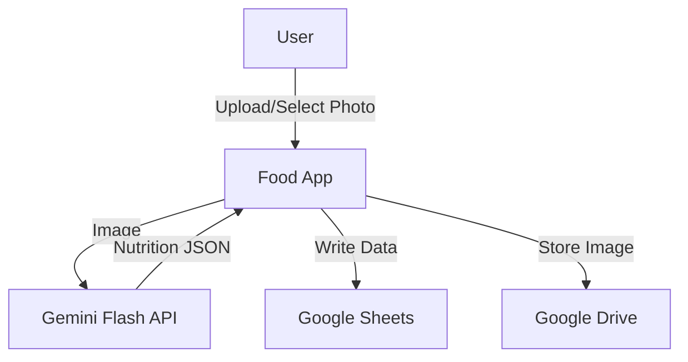
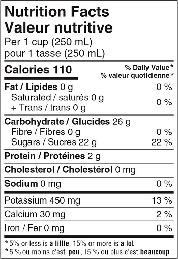

# MVP Design

This document outlines the Minimum Viable Product (MVP) for the Food application.

## Goals
1.  **Interactive Logging**: Capture or select food photos.
2.  **AI Nutrition Estimation**: Use Gemini Flash to estimate nutrition facts (Canadian Standard) from images.
3.  **Cloud Storage**: Use Google Drive (Photos) and Google Sheets (Data) as the backend.

## Architecture



## User Stories

### Authentication
-   **US-001**: As a user, I want to sign in with my Google account so that the app can access my Drive and Sheets.
-   **US-002**: As a user, I want to grant minimal necessary permissions so that I trust the app with my data.

### Logging
-   **US-003**: As a user, I want to take a new photo of my food using the camera so that I can log what I am currently eating.
-   **US-004**: As a user, I want to select an existing photo from my library so that I can log a meal I ate earlier.
-   **US-005**: As a user, I want to see a preview of the selected image so that I can confirm I picked the right one.

### Analysis & Editing
-   **US-006**: As a user, I want the app to automatically estimate nutrition facts (Calories, Fat, Carbs, Protein) from my photo so that I save time.
-   **US-007**: As a user, I want to edit the AI-generated values before saving so that I can correct any mistakes.
-   **US-008**: As a user, I want to specify the "Meal Type" (Breakfast, Lunch, Dinner, Snack) so that I can categorize my intake.

### Data Management
-   **US-009**: As a user, I want my log entries to be saved to a Google Sheet so that I own my data.
-   **US-010**: As a user, I want the photo to be backed up to a specific folder in Google Drive so that I have a visual history.
-   **US-011**: As a user, I want to save a frequently eaten item as a "Product" (Favorite) so that the AI can recognize it better next time (future scope) or for easy reference.

### Insights
-   **US-012**: As a user, I want to see my total calories and macros for the current day so that I know how much I have left.

## Event Store & Projections (Google Sheets)

The backend will be a single Google Spreadsheet. **The `Events` sheet is the single source of truth.** All other sheets (`Log`, `Products`, `DailyStats`) are **projections** (read models) derived entirely by replaying the events.

### Source of Truth: `Events` Sheet
This sheet contains the append-only log of every significant action that occurred in the system.

| Column | Type | Description |
| :--- | :--- | :--- |
| `EventID` | UUID | Unique ID of the event |
| `Timestamp` | ISO8601 | Server-side timestamp |
| `ActionType` | String | e.g. `log/photoTaken`, `log/aiEstimateReceived`, `log/entryEdited` |
| `Payload` | JSON | The complete Redux action payload |

**Key Events:**
-   `log/photoTaken`: `{ imageId, driveUrl, timestamp }`
-   `log/aiEstimateReceived`: `{ imageId, rawJson, modelVersion }` (Considered a "fact" because AI is non-deterministic)
-   `log/entryEdited`: `{ entryId, fileds: { ... } }`
-   `log/entryConfirmed`: `{ entryId }`

### Projection 1: `Log`
A human-readable table derived from confirmed entries. Useful for manual inspection.

| Column | Type | Description |
| :--- | :--- | :--- |
| `Date` | Date | YYYY-MM-DD |
| `Time` | Time | HH:MM |
| `ImageURL` | URL | Link to image in Google Drive |
| `MealType` | Enum | Breakfast, Lunch, Dinner, Snack |
| `RawText` | String | User description or AI summary |
| `FoodRefID` | String | (Optional) Link to `Products` entry |
| `Calories` | Number | kcal |
| `Fat` | Number | g |
| `Carbs` | Number | g |
| `Protein` | Number | g |
| `Sodium` | Number | mg |
| `Sugar` | Number | g |
| `Fibre` | Number | g |
| `JSON` | JSON | Full raw JSON from Gemini |

### Projection 2: `Products`
Reusable database for repetitive items (barcodes, common meals). Derived from `product/created` or `product/updated` events.

| Column | Type | Description |
| :--- | :--- | :--- |
| `ID` | String | UUID or Barcode |
| `Name` | String | |
| `Barcode` | String | (Optional) |
| `NutritionJSON` | JSON | Validated nutrition facts |
| `ImageURL` | URL | Representative image |

### Projection 3: `DailyStats`
Pivot table or formula-based aggregation. Derived from the `Log` projection.

-   **Rows**: Date
-   **Columns**: Sum(Calories), Sum(Protein), etc.

## Gemini Integration

### Model
-   **Model**: `gemini-1.5-flash`
-   **Input**: Image (Binary/Base64) + Prompt

### Prompt Strategy
We will prompt Gemini to act as an expert nutritionist using the Canadian Nutrition Facts standard.

**System Prompt:**
> You are an expert dietician. Analyze the provided image.
> 1. If it is a **Nutrition Facts label**, extract the data exactly as shown.
> 2. If it is a **food item/meal**, estimate the nutrition facts based on visible portion sizes and standard values.
> 3. Return the data **exclusively** in the following JSON format matching the Canadian Nutrition Facts table standard:

```json
{
  "is_label": boolean,
  "item_name": "string",
  "serving_size": "string",
  "calories": number,
  "fat": {
    "total": number, // g
    "saturated": number, // g
    "trans": number // g
  },
  "carbohydrates": {
    "total": number, // g
    "fibre": number, // g
    "sugars": number // g
  },
  "protein": number, // g
  "cholesterol": number, // mg
  "sodium": number, // mg
  "potassium": number, // mg
  "calcium": number, // mg
  "iron": number // mg
}
```

### Reference Standard


## Workflow

### 1. Capture/Select
-   User takes a photo or selects from Google Photos picker.
-   App validates image is usable.

### 2. Analysis
-   App sends image to Gemini Flash.
-   Gemini returns JSON estimate.
-   User reviews and edits the estimated values (UI must allow overrides).

### 3. Log
-   User confirms entry.
-   App uploads image to specific Google Drive folder (e.g., `FoodApp/Images/YYYY/MM`).
-   App appends row to `Log` sheet in Google Sheets.
-   App checks if item should be added to `Products` (e.g. "Save to Favorites").

## Authentication
-   **Provider**: Google OAuth 2.0
-   **Scopes**:
    -   `https://www.googleapis.com/auth/drive.file` (Create/Edit app-specific files)
    -   `https://www.googleapis.com/auth/spreadsheets` (Read/Write sheets)
    -   `https://www.googleapis.com/auth/photoslibrary.readonly` (Select photos)
