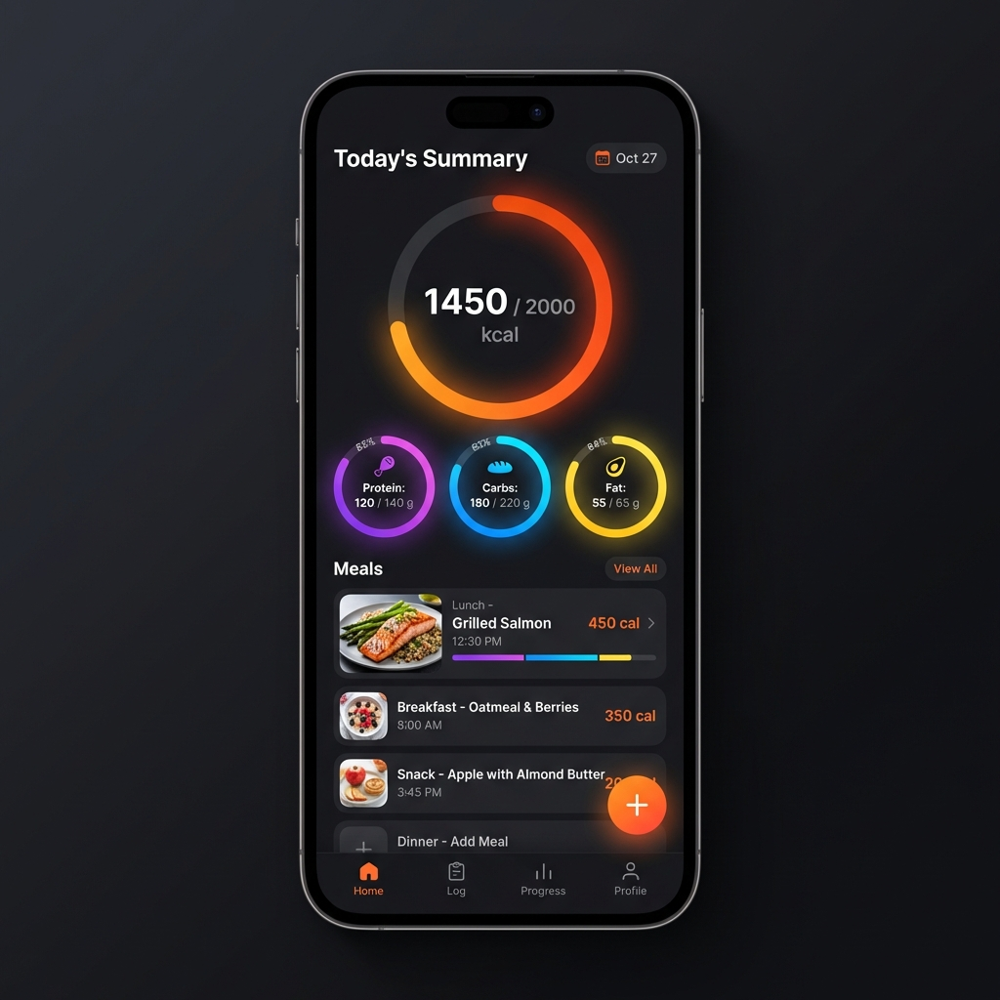
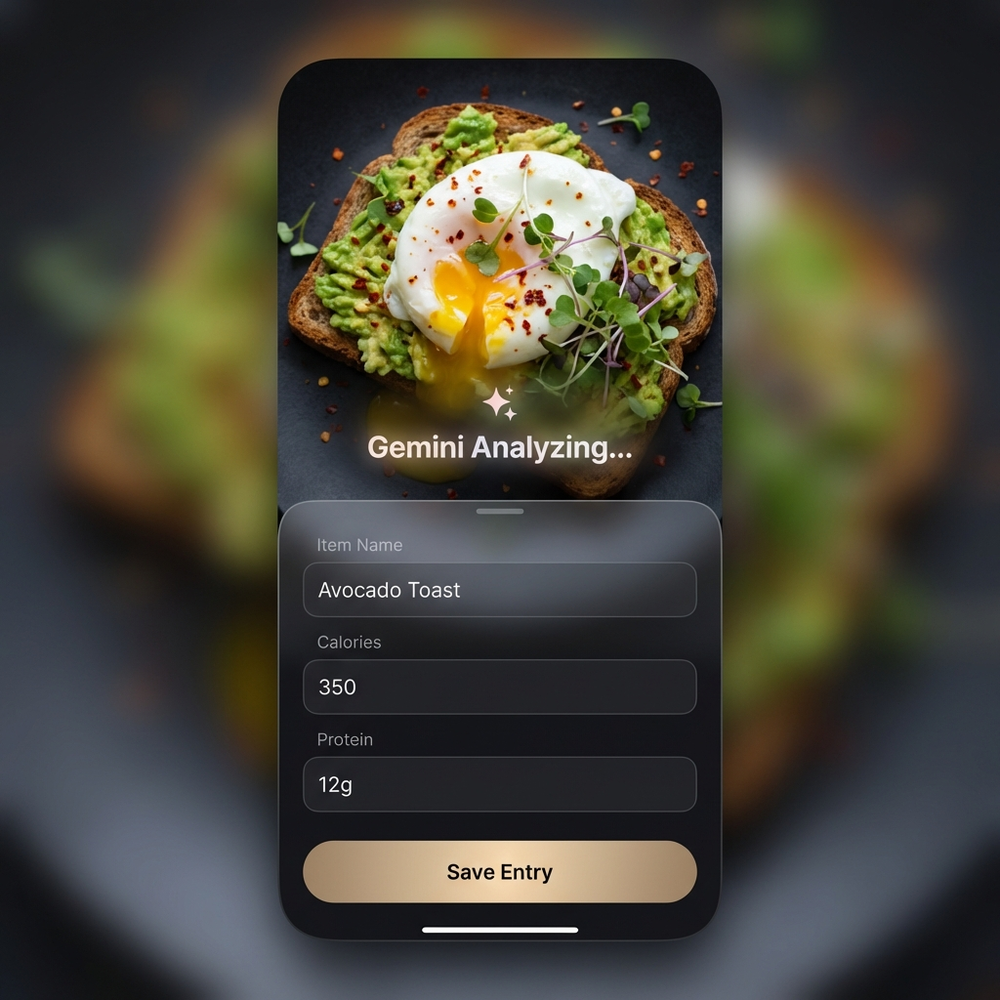
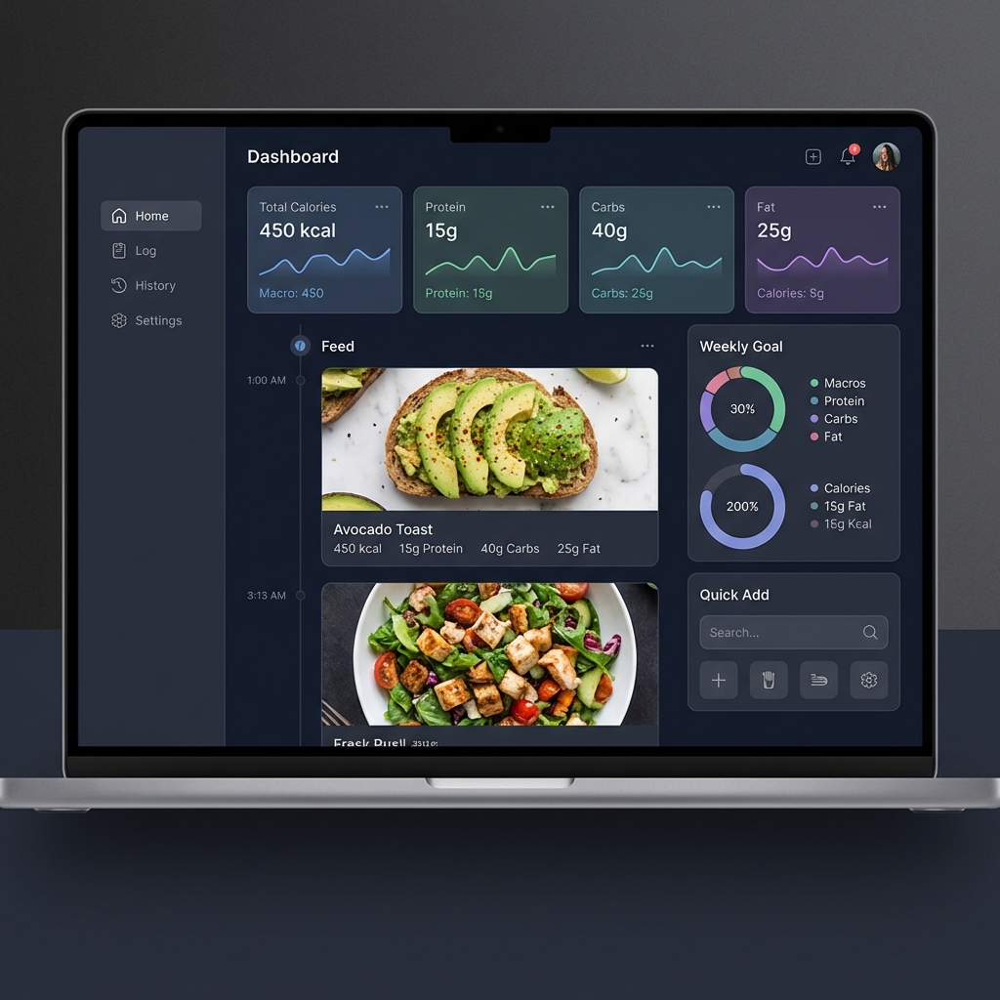

# UI Overhaul Design Document

## 1. Overview
The goal of this overhaul is to transform the functional but utilitarian food logging application into a **premium, modern, and engaging experience**. The design philosophy centers on "Immersive Utility"—making the core action (logging) feel magical and the consumption of data (stats) feel rewarding.

The UI will be **Phone-First** but **Laptop-Responsive**, ensuring a seamless experience across devices while acknowledging that food logging is primarily a mobile activity.

## 2. Design Philosophy & System
We will adopt a **Modern Dark Mode** aesthetic with **Glassmorphism** accents to create depth and hierarchy.

### 2.1 Core "Vibe"
-   **Dark & Sleek:** Deep charcoal backgrounds (`#121212`, `#1E1E1E`) rather than pure black, reducing eye strain and increasing perceived quality.
-   **Vibrant Data:** Data points (Calories, Macros) use neon/vibrant gradients (Orange/Red for Calories, Purple/Green/Blue for macros) to pop against the dark background.
-   **Glassmorphism:** Navigation bars, cards, and overlays will use semi-transparent backgrounds with background blur (`backdrop-filter: blur(12px)`) to provide context and depth.
-   **Soft & Round:** Generous border radii (20px-32px) on cards and buttons to feel friendly and tactile.

### 2.2 Typography
-   **Primary Font:** Inter or San Francisco (system-ui).
-   **Headings:** Bold, tight tracking.
-   **Numbers:** Monospaced or tabular figures for data alignment.

## 3. Key Screens & Flows

### 3.1 Mobile Dashboard (Home)
The home screen is the command center. It answers "How am I doing today?" at a glance.

**Key Features:**
-   **Hero Stats Ring:** A large, animated ring chart for the daily calorie goal. It's the visual anchor.
-   **Macro Bubbles:** Secondary stats (Protein, Carbs, Fat) are smaller, colored rings or bubbles below the main goal.
-   **Meal Feed:** A vertical scrollable list of today's meals. Each card features a high-quality thumbnail (if available) and key stats.
-   **Floating Action Button (FAB):** A prominent `+` button at the bottom right for the primary action: Logging Food.



### 3.2 Mobile Log Food Experience
The logging flow should feel "magic". AI analysis is the star.

**Key Features:**
-   **Immersive Capture:** When taking a photo, the viewfinder takes up most of the screen.
-   **"Magic" State:** While Gemini analyzes, show a sparkling/shimmering overlay on the image, reinforcing that "work is happening".
-   **Sheet-Based Editing:** The results appear in a bottom sheet that slides up over the image. This keeps the context (the photo) visible while editing.
-   **Smart Defaults:** Fields like "Time" and "Meal Type" are auto-filled based on context.



### 3.3 Laptop Dashboard (Responsive)
On larger screens, the UI shifts from a vertical stack to a grid-based dashboard.

**Key Features:**
-   **Sidebar Navigation:** Permanent navigation on the left for quick access to history, settings, and reports.
-   **Data Density:** Use the extra width to show trend charts (Last 7 Days) side-by-side with the daily summary.
-   **Timeline View:** The central feed expands to show more details per entry (macros breakdown per meal) without needing to tap in.
-   **Quick Add Widget:** A dedicated "Quick Add" area always visible for rapid text-based logging.



## 4. Implementation Guidelines (CSS & Svelte)

### 4.1 CSS Variables Strategy
We will define a strict set of tokens to ensure consistency.

```css
:root {
    /* Backgrounds */
    --bg-app: #0f1014;
    --bg-card: #1c1e24;
    --bg-card-glass: rgba(28, 30, 36, 0.7);

    /* Text */
    --text-primary: #ffffff;
    --text-secondary: #a0a0a0;
    --text-accent: #ff6b6b;

    /* Brand Gradients */
    --gradient-calories: linear-gradient(135deg, #FF9966 0%, #FF5E62 100%);
    --gradient-protein: linear-gradient(135deg, #c471ed 0%, #f64f59 100%);

    /* Spacing */
    --radius-l: 24px;
    --radius-m: 16px;
    --pad-page: 20px;
}
```

### 4.2 Component Architecture
-   **`StatsRing.svelte`**: SVG-based component for the circular progress. accepting `value`, `max`, `color`.
-   **`FoodCard.svelte`**: The main list item. Handles layout for Image + Text + Quick Stats.
-   **`LogSheet.svelte`**: A reusable bottom-sheet component for mobile editing. Uses CSS transitions for slide-up animation.
-   **`Layout.svelte`**: Handles the responsive switch between `MobileNav` (Bottom Bar/FAB) and `DesktopSidebar`.

## 5. Next Steps
1.  **Foundation**: Set up the `app.css` with the new dark mode variables and reset.
2.  **Components**: Build the `StatsRing` and `FoodCard` components.
3.  **Layout**: detailed implementation of the responsive grid for desktop.
