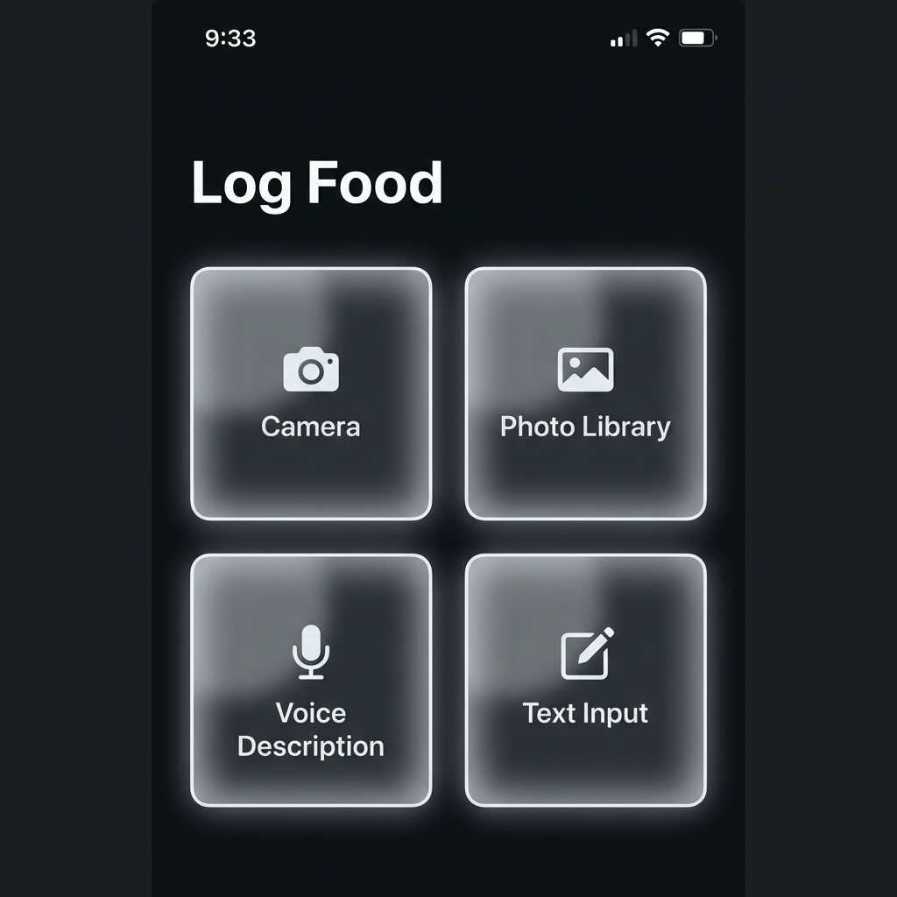
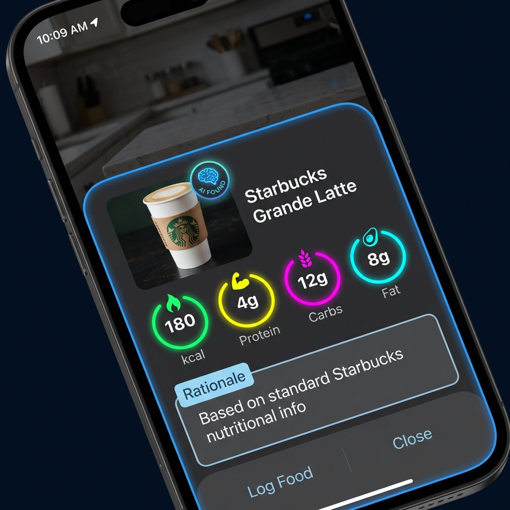

# UI Log Food: Text & Voice Input Design

## 1. Overview
The current food logging experience differs significantly from the vision of "Immersive Utility". While camera-first logging is powerful, users often need to log food retrospectively or in situations where taking a photo is socially awkward.

This design introduces **Text and Voice** logging as first-class citizens, sitting alongside the Camera and Photo Library inputs. The goal is to allow users to simply *describe* their meal (e.g., "A Starbucks Grande Latte with oat milk") and have Gemini perform the same magic it does with images, including fetching a representative image from the internet.

## 2. User Interface Design

### 2.1 The "Log Food" Hub
The current start screen with three vertical buttons will be replaced by a unified **Grid Layout** (2x2) that presents all input methods with equal weight. This creates a "Command Center" feel.

**Input Methods:**
1.  **Camera** (Existing): Capture live.
2.  **Photo Library** (Existing): Pick from past.
3.  **Voice Description** (New): Speak natural language.
4.  **Text Input** (New): Type detail or paste.

**Visual Style:**
*   Large, glassmorphic cards.
*   Centralized icons with clear labels.
*   Deep dark theme consistent with `UI_OVERHAUL.md`.



---

### 2.2 Text Input Flow
When "Text Input" is selected, a focused modal overlay appears. It is simpler than the full form—just a "What did you eat?" prompt.

*   **Input:** Large, multi-line text area.
*   **Action:** "Analyze" button (Neon Gradient).
*   **Smart Suggestions:** (Future) Recent items or frequent meals.

### 2.3 Voice Input Flow
When "Voice Description" is selected, the UI shifts to a listening state.

*   **Visuals:** A pulsing, glowing microphone icon.
*   **Feedback:** A dynamic waveform visualization that reacts to audio levels (using Web Audio API).
*   **Transcription:** Real-time text preview of what the user is saying.
*   **Action:** Auto-detect silence to submit, or manual "Stop & Analyze" button.


---

### 2.4 The Log Result (Proposal)
The result of a text/voice log should look identical to an image log, maintaining consistency. The key difference is the source of the image.

**"AI Found" Image Strategy:**
Since the user didn't provide a photo, the system must fetch one.
1.  **Search:** Use the inferred food name to search for a high-quality food image (Google Custom Search or Unsplash).
2.  **Badge:** Overlay a small "AI Found" or "Web Image" badge on the photo to transparently indicate it's not the user's own photo.
3.  **Rationale:** The simplified text description is preserved in the "Log Description", and the rationale explains how the macros were estimated from text.



## 3. Technical Implementation Details

### 3.1 `src/routes/log/+page.svelte` Refactor
The simplistic `showCamera` boolean logic is insufficient for 4 states. We will introduce a state machine for the UI modes.

```typescript
type LogMode = 'IDLE' | 'CAMERA' | 'VOICE' | 'TEXT' | 'PREVIEW';
let currentMode = $state<LogMode>('IDLE');
```

**New Components:**
*   `InputGrid.svelte`: The 2x2 selection screen.
*   `VoiceRecorder.svelte`: Handles `MediaRecorder` API, visualization canvas, and silence detection.
*   `TextInputModal.svelte`: Simple text area with "Analyze" action.

### 3.2 Gemini Integration Updates (`$lib/gemini.ts`)
The `analyzeImage` function currently expects base64 images. We need to overload this or create a new `analyzeText` function.

**Prompt Strategy:**
For text input, the prompt to Gemini changes slightly:
*   **Input:** "User ate: {userText}"
*   **Task:** "Estimate nutrition... AND suggest a precise search query to find an image of this food."

### 3.3 Image Fetching Service (`$lib/image-search.ts`)
We need a new service to fetch images.
*   **Provider:** Google Custom Search API (CSE) is the most reliable for matching specific food descriptions.
*   **Fallback:** If CSE fails, use a generic placeholder like "Meal.jpg" or generate one (too slow/expensive?).
*   **Implementation:**
    1.  Get `searchQuery` from Gemini analysis.
    2.  Call CSE API -> Get Image URL.
    3.  Proxy the image (if needed for CORS) or use directly if allowed.
    4.  Pass this URL to the `Entry` object as `imageDriveUrl` (or a specific `externalImageUrl`).

### 3.4 Web Speech API
For voice input, we will use the browser's native `SpeechRecognition` (or `webkitSpeechRecognition`) API.
*   **Pros:** Free, built-in, no extra latency.
*   **Cons:** Browser support varies (excellent on Chrome/Android, good on Safari iOS 14.5+).
*   **Fallback:** If not supported, hide the Voice icon or show an alert.

## 4. Work Breakdown
1.  **State Management:** Refactor `+page.svelte` to support multiple input modes.
2.  **UI Components:** Build the Grid, Text Modal, and Voice Recorder UI.
3.  **Backend Logic:** Update Gemini prompt to handle text-only input and return a search query.
4.  **Image Service:** Implement Google Custom Search for fetching food images.
5.  **Integration:** Wire it all together so "Starbucks Latte" -> Gemini -> Search Image -> Log Proposal.
