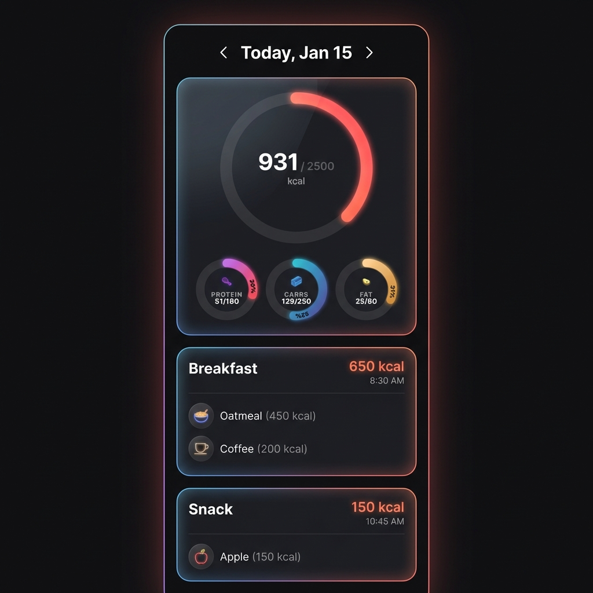

# Grouped Logging UX Design

## 1. Goal
To evolve the food log from a flat list of individual entries into a structured, narrative view of the user's day. The interface will group related logs into "Eating Activities" (Meals and Snack Clusters) to provide a cleaner, higher-level overview while retaining the ability to drill down into specifics.

## 2. Core Logic

### 2.1 The "Day" Boundary
-   **Start Time:** 04:00 AM
-   **End Time:** 03:59 AM (Next Day)
-   **Rationale:** Late-night eating (e.g., 11:55 PM and 12:05 AM) belongs psychologically to the "previous" day. Splitting them breaks the user's mental model of their daily intake.

### 2.2 Activity Grouping
Logs will be clustered into "Cards" based on type and time.

#### A. Meals (Breakfast, Lunch, Dinner)
-   **Criteria:** Any log explicitly tagged as `Breakfast`, `Lunch`, or `Dinner`.
-   **Behavior:** All logs of the same meal type for a given day are grouped into a single card, regardless of the exact timestamp (though they are usually close).
-   **Display:**
    -   Title: Meal Name (e.g., "Breakfast")
    -   Time: Range (e.g., "8:30 AM - 9:00 AM") or Start Time of the first item.
    -   Stats: Aggregate Sum (Calories, Macros).

#### B. Snacks (Time-Based Clustering)
-   **Criteria:** Logs tagged as `Snack`.
-   **Clustering Logic:** Snacks eaten within **30 minutes** of each other are grouped into a single "Snack Break" card.
-   **Example:**
    -   10:00 AM: Apple
    -   10:20 AM: Almonds
    -   -> **Grouped** (Single Card: "Snack • 10:00 AM")
    -   2:00 PM: Protein Bar
    -   -> **Separate** (New Card)

## 3. User Interface

### 3.1 Overview
The view is a vertical feed anchored by a fixed navigation bar and a summary card.

### 3.2 Navigation & Header
-   **Top Bar:** A clean navigation bar allowing travel between days.
    -   `[ < ]` (Previous Day)
    -   `Current Date` (e.g., "Today, Jan 15") - Tapping opens calendar/view switcher.
    -   `[ > ]` (Next Day)

### 3.3 Stats Summary Card
-   **Location:** Fixed at the top of the scrollable feed (or sticky).
-   **Content:**
    -   **Primary:** Large "Calories Left" or "Calories Consumed" Ring (Neon Orange).
    -   **Secondary:** Three smaller rings/bubbles for Protein (Purple), Carbs (Blue), and Fat (Yellow).
-   **Style:** Glassmorphic container, vibrant neon data points against a dark charcoal background.

### 3.4 The Feed (Activity Cards)
Below the stats, the list displays **Activity Cards** instead of raw logs.

**Card Layout:**
1.  **Header:**
    -   **Left:** Activity Name (e.g., "Breakfast", "Snack").
    -   **Right:** Total Calories (e.g., "650 kcal") in vibrant neon orange.
    -   **Sub-data:** Start Time.
2.  **Content List:**
    -   Clean list of items in the group (e.g., "Oatmeal", "Coffee").
    -   Individual calorie counts are shown subtly.
    -   **No "Body" labels or clutter.**
3.  **Interaction:**
    -   **Tap:** Expands the card or navigates to a "Detail View" to edit/delete individual items.

### 3.5 Visual Mockup
*Revised Nano Banana Style: Dark mode, glassmorphism, stats summary at top.*

## 4. Navigation & Summaries (Brainstorming)

### 4.1 Day View (Default)
-   Focus: Vertical scroll of today's cards.
-   Header: "Today" with navigating arrows (< Yesterday >).

### 4.2 Week / Month Views
To handle reviewing multiple days, we introduce specific summary views:

-   **Week View:**
    -   Row per day.
    -   Columns: Calories, Protein, Carbs, Fat bars.
    -   Tap a row to jump to that Day's specific log view.
-   **Month View (Calendar):**
    -   Heatmap style (Green = Hit Goal, Red = Over, Grey = Under).
    -   High-level pattern recognition.

## 5. Implementation Strategy
1.  **Refactor Selectors:** Update Redux selectors to implement the grouping logic (4AM split, 30m window).
2.  **New Components:** Create `ActivityCard.svelte` to handle the rendering of a group.
3.  **View Migration:** Swap the `LogFeed` to iterate over specific `groups` rather than raw `logs`.
