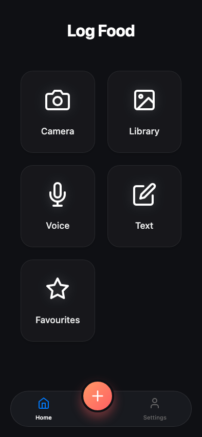
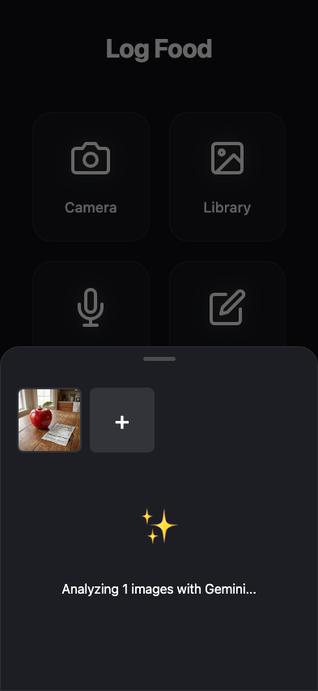
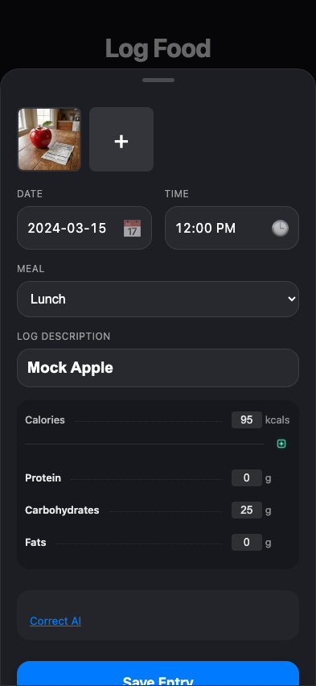
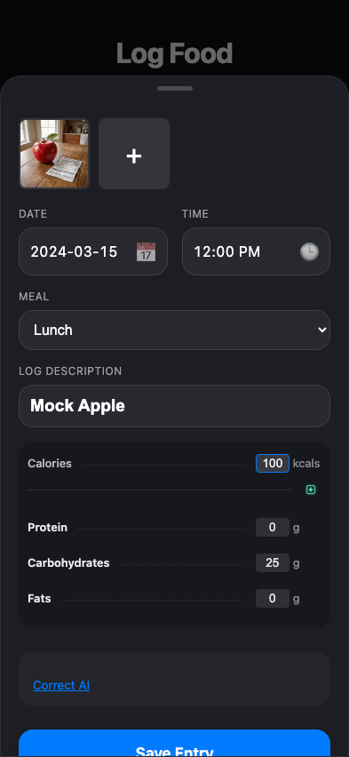
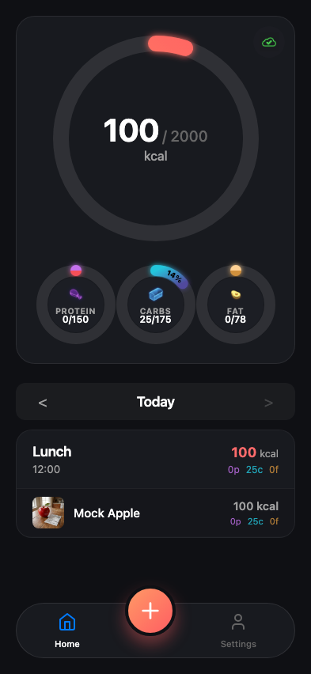

# Test: US-003 to US-010: User logs food flow

## User on log page

**Verifications:**
- [x] Camera button visible
- [x] Upload button visible
- [x] Voice button visible
- [x] Text button visible

---

## Image preview shown

**Verifications:**
- [x] Preview visible
- [x] Status is Analyzing

---

## AI Analysis Received

**Verifications:**
- [x] Calories populated

---

## User corrects analysis

**Verifications:**
- [x] Calories updated to 100
- [x] Meal type is Lunch

---

## Returned to Dashboard

**Verifications:**
- [x] On Dashboard
- [x] Activity Card appears
- [x] Meal type shown in header
- [x] Total Cals shown in header
- [x] Item name shown
- [x] Item calories shown

---

