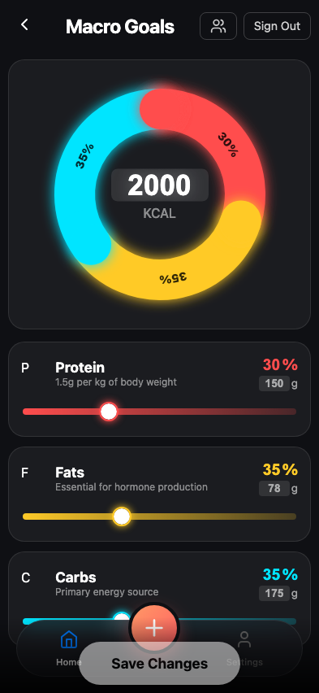
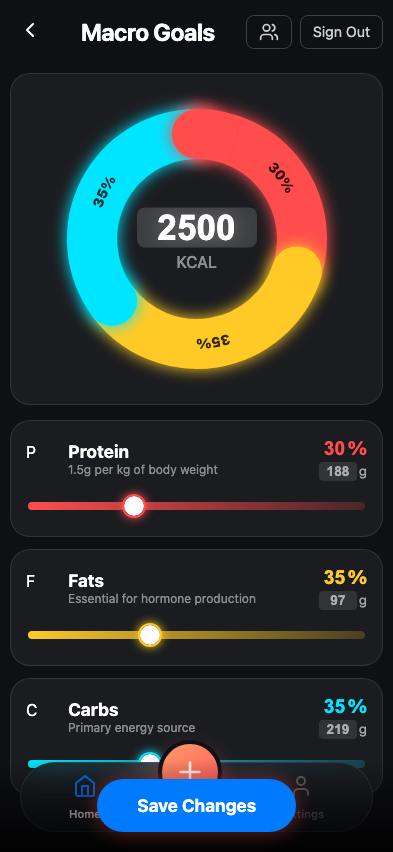
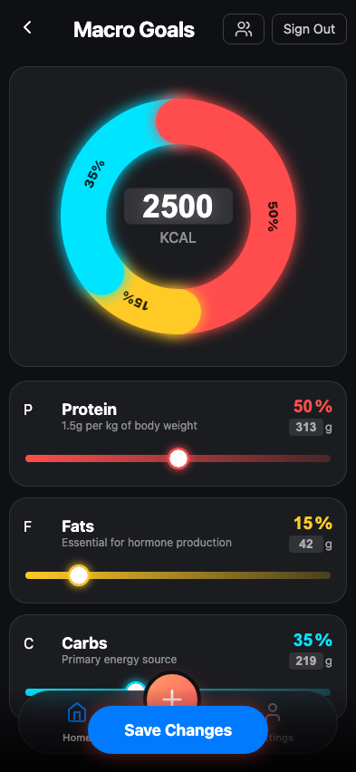
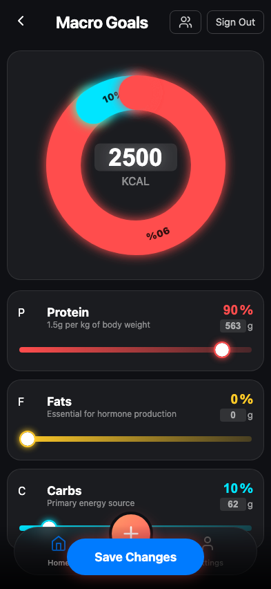
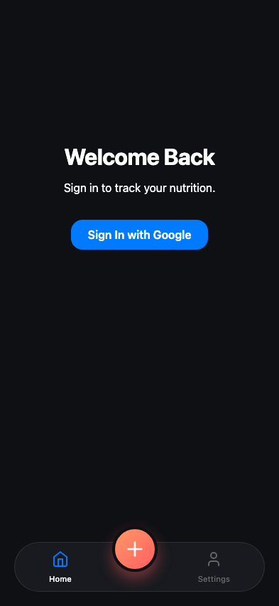

# Test: User configures macro settings

## Settings page loads with defaults

**Verifications:**
- [x] Url is correct
- [x] Title is visible
- [x] Donut chart is visible
- [x] Calories input is 2000
- [x] Protein slider is 30%
- [x] Save button is disabled

---

## Changed calories to 2500

**Verifications:**
- [x] Dirty state (Save enabled)
- [x] Center text updates
- [x] Protein Grams updates (30% of 2500 / 4)

---

## Increased Protein to 50%

**Verifications:**
- [x] Protein is 50%
- [x] Fat reduced to 15%
- [x] Carbs remains 35%
- [x] Chart segment updates

---

## Increased Protein to 90% (consuming Fat and Carbs)

**Verifications:**
- [x] Protein is 90%
- [x] Fat is 0%
- [x] Carbs is 10%

---

## Saved settings and redirected

**Verifications:**
- [x] Redirected to dashboard

---

