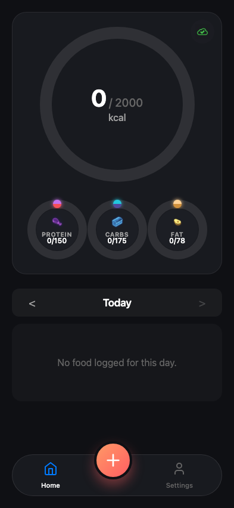

# Test: US-023: Auth Persistence

## Reload page and verify session

**Verifications:**
- [x] Token in localStorage
- [x] User still logged in after reload

---

## Simulate token expiration within 48h window

**Verifications:**
- [x] Silent refresh keeps user logged in

---

## Simulate token expiration beyond 48h window

**Verifications:**
- [x] Logged out after 48h expiry

---

