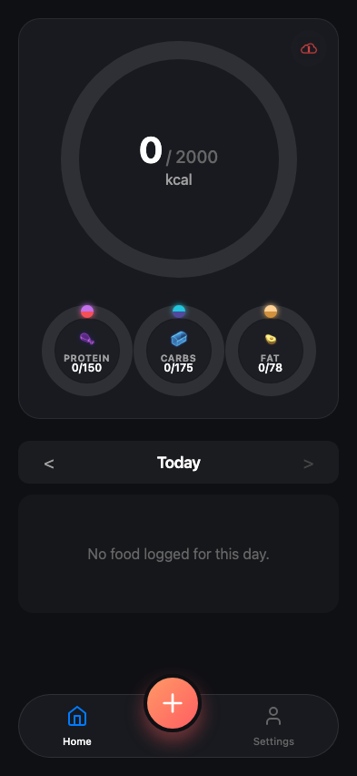
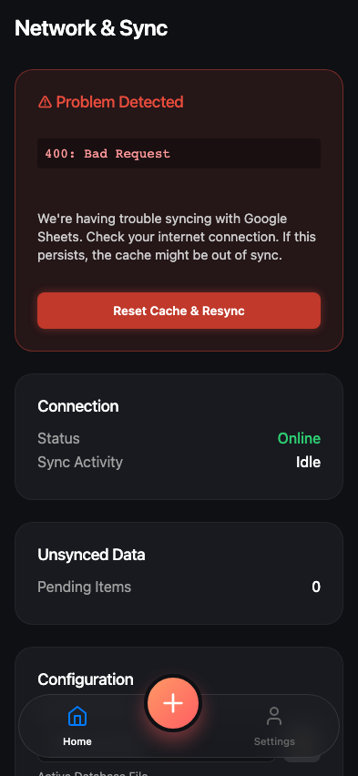

# Test: should display error UI when sync fails

## Error icon is displayed on sync failure

**Verifications:**
- [x] Status button has error state

---

## Error details and troubleshooting section are visible

**Verifications:**
- [x] Error panel visible
- [x] Correct error message

---

