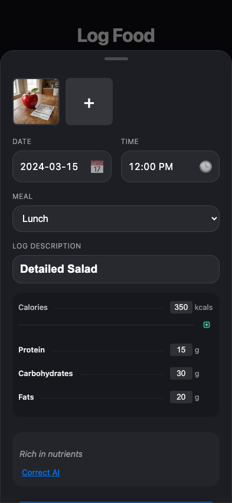
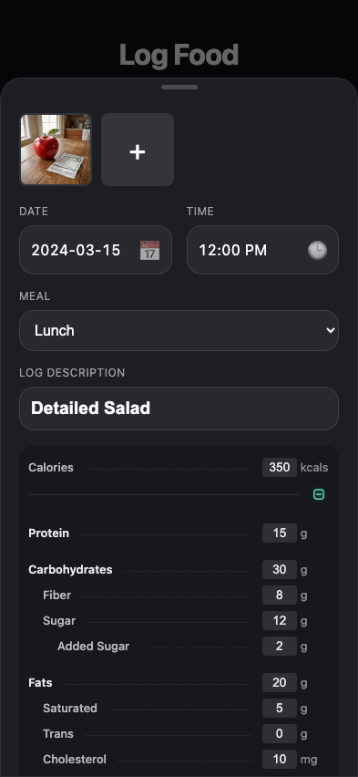
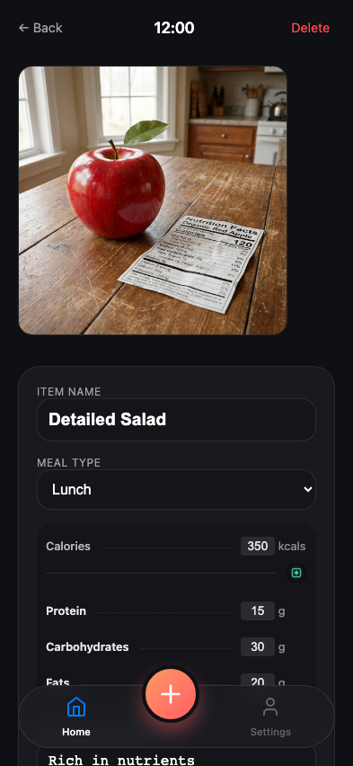
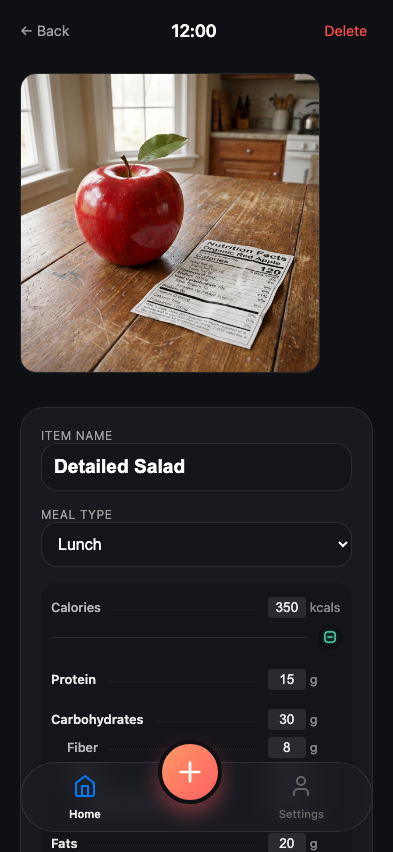
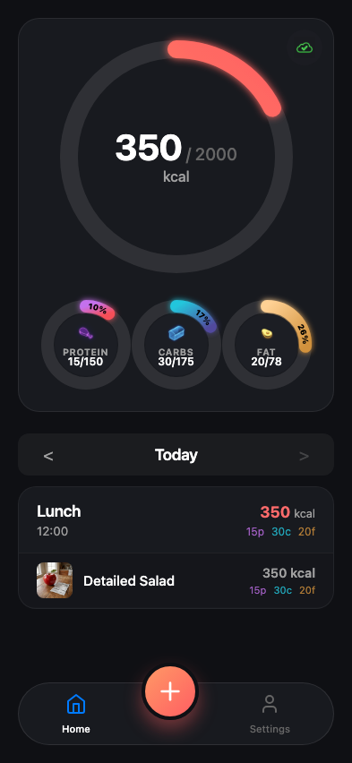

# Test: 013-detailed-nutrition: Log and Edit Detailed Nutrition

## Setup: Mock Drive and Gemini

**Verifications:**
- [x] Drive and Gemini APIs mocked

---

## Action: Navigate to Log and Enter Text

**Verifications:**
- [x] Log page reachable and analysis returns details

---

## Verification: Check Unified Form with Details

**Verifications:**
- [x] Item name populated
- [x] Calories match
- [x] Detailed fields visible after toggle

---

## Action: Save Entry

**Verifications:**
- [x] Save redirects to home

---

## Action: Open Entry in Detail View

**Verifications:**
- [x] Entry opens

---

## Verification: Check Details Persisted

**Verifications:**
- [x] Details align with mocked data

---

## Action: Edit Detail (Independent Fields)

**Verifications:**
- [x] Edit Fiber does NOT update Total Carbs (Decoupled)

---

## Verification: Verify Edit Persisted

**Verifications:**
- [x] Caffeine value is now 50
- [x] Fiber is 40 and Carbs is 30

---

