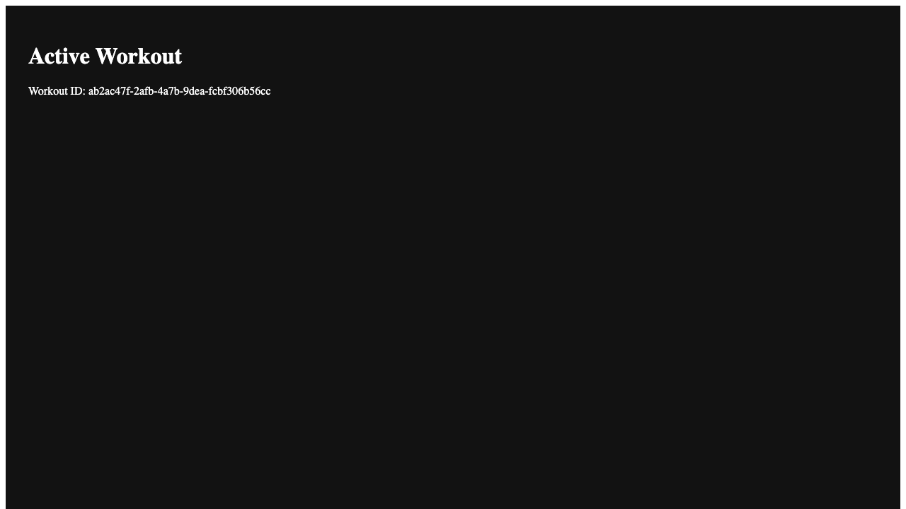

# Start Workout

**User Story**: As a user, I want to start a new workout session.

## Step 0: Dashboard is visible

**Verifications:**
- [x] Title is Workouts
- [x] Start Workout button is visible

---

## Step 1: Workout session is active

**Verifications:**
- [x] Navigated to workout page
- [x] Active Workout header is visible

---
