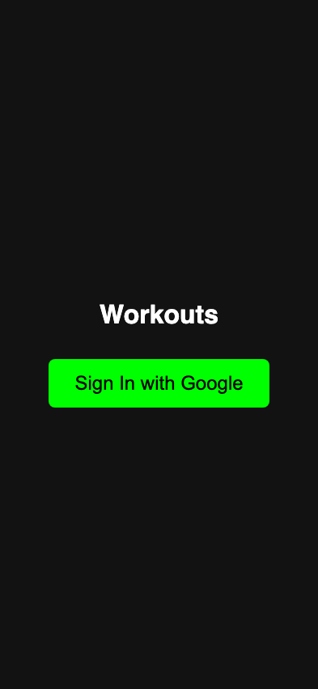
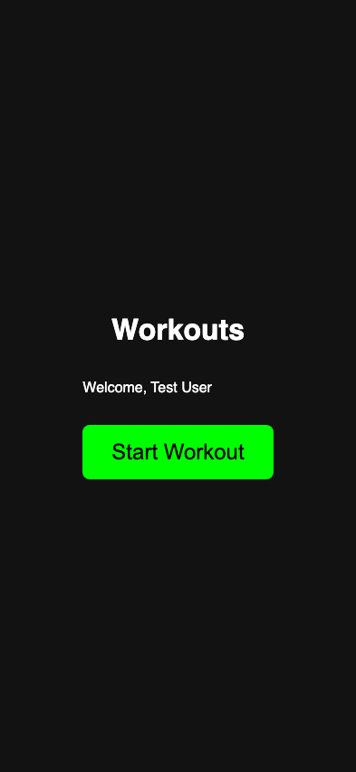
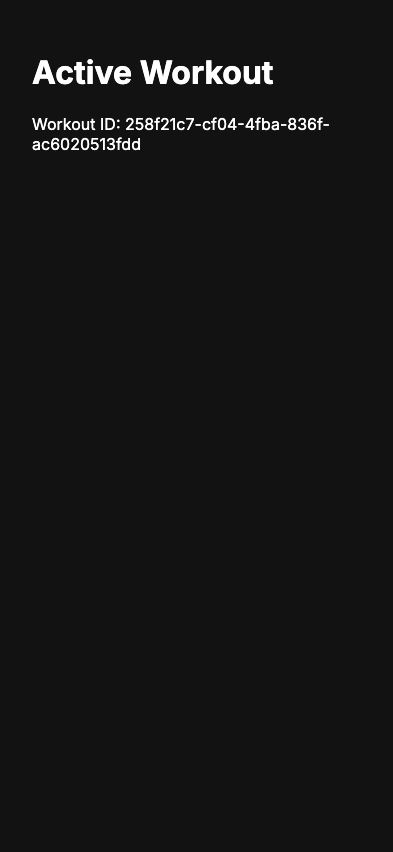

# Start Workout

**User Story**: As a user, I want to sign in and start a new workout session.

## Step 0: Sign In button is visible

**Verifications:**
- [x] Title is Workouts
- [x] Sign In button is visible

---

## Step 1: User is signed in and sees dashboard

**Verifications:**
- [x] Start Workout button is visible

---

## Step 2: Workout session is active

**Verifications:**
- [x] Navigated to workout page
- [x] Active Workout header is visible

---
