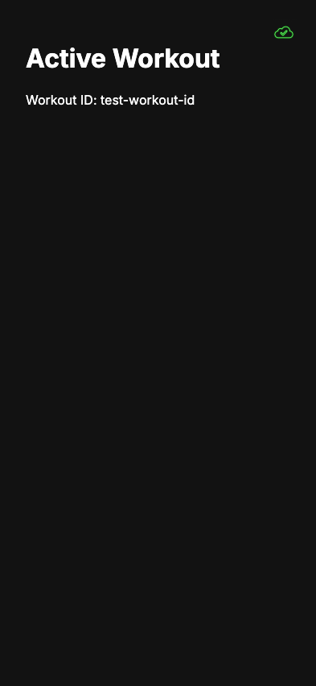

# Action Persistence

**User Story**: As a user, my actions should be logged to a spreadsheet and I should see sync status.

## Step 0: InternalEventLog spreadsheet should be created

**Verifications:**
- [x] Log sheet created

---

## Step 1: workout/start action should be appended to log

**Verifications:**
- [x] Action appended

---

## Step 2: Sync status icon should be visible

**Verifications:**
- [x] Sync icon visible

---
