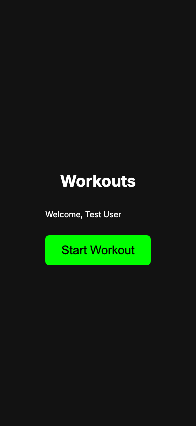

# Config Sync

**User Story**: As a user, my exercises should be synced from a Google Sheet.

## Step 0: Sync should complete and populate store

**Verifications:**
- [x] Sheet was created
- [x] Defaults were appended

---
